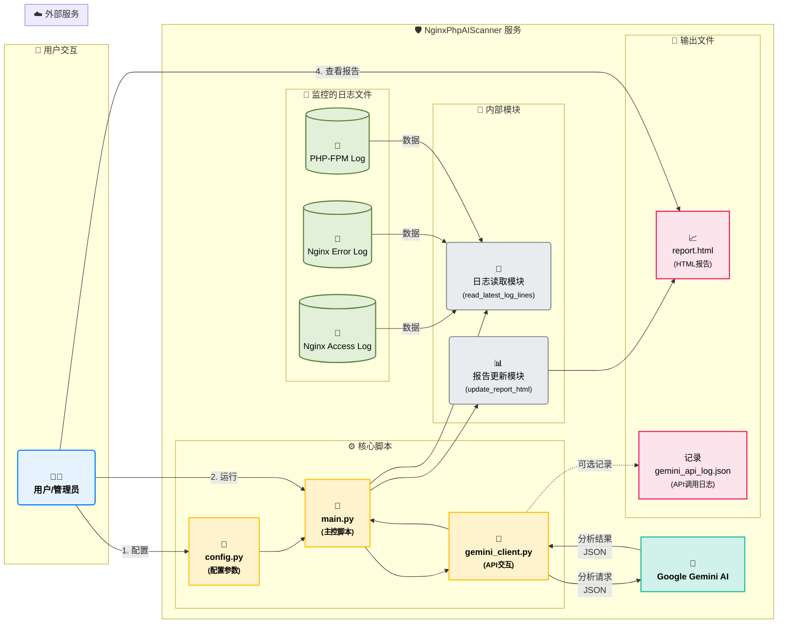

# Nginx PHP AI 安全检测服务 (NginxPhpAIScanner)

[](https://github.com/RusianHu/NginxPhpAIScanner) [](LICENSE) [](https://www.python.org/downloads/) [](https://github.com/RusianHu/NginxPhpAIScanner)

## 项目概述

NginxPhpAIScanner 是一个 Python 服务，旨在通过分析 Nginx 和 PHP-FPM 的日志文件，利用 Google Gemini AI 模型来自动检测潜在的安全威胁、入侵尝试或恶意活动。服务会定期扫描指定的日志文件，将分析结果生成并更新到一个静态的 HTML 报告页面，方便管理员监控服务器安全状态。

## 功能特性

*   **定时日志扫描**：定期（默认为每5分钟）读取 Nginx 访问日志、Nginx 错误日志和 PHP-FPM 错误日志的最新内容（默认为最新的500行）。
*   **AI 驱动的威胁分析**：利用 Gemini AI 模型 (`gemini-2.5-flash-preview-05-20`) 对收集到的日志数据进行深度分析，识别潜在安全风险。
*   **动态 HTML 报告**：将分析结果（包括错误信息和正常状态）动态更新到用户指定的静态 HTML 报告页面。报告页面包含时间戳、日志类型、详细发现和总体摘要。
*   **错误处理**：对配置文件缺失、API 密钥无效、日志文件不可读、API 调用失败等多种异常情况进行了处理，并将相关错误信息记录到控制台和 HTML 报告中。
*   **Gemini API 调用记录** (可选)：可以配置记录所有对 Gemini API 的请求和响应（或错误）到指定的 JSON Lines 文件中，方便调试和审计。此功能默认为开启。

## 项目逻辑

以下是 NginxPhpAIScanner 项目的逻辑结构图和详细说明：



<details>
<summary>详细逻辑说明：</summary>

1.  **配置加载 ([`config.py`](config.py:0))**：
    *   用户首先需要编辑 [`config.py`](config.py:0) 文件，设置 Gemini API 密钥、项目 ID、Nginx 和 PHP-FPM 日志文件的准确路径、报告 HTML 文件的输出路径，以及扫描频率等参数。
    *   此配置文件是整个服务的行为基础。

2.  **主程序启动 ([`main.py`](main.py:0))**：
    *   用户通过 `python main.py` 命令启动服务。
    *   [`main.py`](main.py:0) 中的 [`main_scan_loop()`](main.py:294) 函数是核心的调度器。它首先会检查所有必要的配置是否已设置，如果配置不完整则会提示错误并退出。
    *   如果报告 HTML 文件尚不存在，会先创建一个基础的空报告。

3.  **定时扫描循环**：
    *   服务进入一个无限循环，每次循环代表一轮日志检测。
    *   循环的间隔时间由 [`config.py`](config.py:24) 中的 `SCAN_INTERVAL_SECONDS` 控制。

4.  **日志读取 ([`read_latest_log_lines()`](main.py:18) in [`main.py`](main.py:0))**：
    *   在每一轮检测开始时，脚本会针对 [`config.py`](config.py:0) 中定义的 Nginx 访问日志、Nginx 错误日志和 PHP-FPM 日志，分别调用 [`read_latest_log_lines()`](main.py:18) 函数。
    *   该函数负责读取指定日志文件的最后 `LOG_LINES_TO_READ` 行内容。
    *   如果日志文件不存在或为空，会记录相应信息并跳过该日志的分析。

5.  **AI 分析请求 ([`call_gemini_api()`](gemini_client.py:35) in [`gemini_client.py`](gemini_client.py:0))**：
    *   对于每个成功读取到内容的日志文件，其数据会被传递给 [`gemini_client.py`](gemini_client.py:0) 中的 [`call_gemini_api()`](gemini_client.py:35) 函数。
    *   此函数负责：
        *   构建发送给 Google Gemini API 的 HTTP 请求。请求体中包含一个精心设计的 `systemInstruction` (系统提示)，指示 AI 模型扮演网络安全分析师的角色，并要求其以特定的 JSON 格式返回分析结果（包括发现、严重性、描述、建议和摘要）。
        *   使用 `requests` 库将包含日志数据的请求发送到 `GEMINI_API_URL`。
        *   处理 API 的响应，包括错误检查和 JSON 解析。模型返回的原始文本输出会被再次尝试解析为 JSON 对象。

6.  **API 调用日志记录 (可选)**：
    *   如果 [`config.py`](config.py:27) 中的 `LOG_GEMINI_API_CALLS` 设置为 `True`，[`gemini_client.py`](gemini_client.py:0) 中的 [`_log_api_call()`](gemini_client.py:8) 函数会将每次对 Gemini API 的请求详情和响应内容（或错误信息）以 JSON Lines 格式记录到 [`config.py`](config.py:30) 中 `GEMINI_API_LOG_PATH` 指定的文件中。

7.  **结果整合与报告更新 ([`update_report_html()`](main.py:33) in [`main.py`](main.py:0))**：
    *   [`call_gemini_api()`](gemini_client.py:35) 返回的分析结果（或错误信息）会被收集起来。
    *   所有日志类型的分析结果将传递给 [`main.py`](main.py:0) 中的 [`update_report_html()`](main.py:33) 函数。
    *   此函数负责：
        *   读取现有的 HTML 报告文件（如果存在）。
        *   将新的分析结果格式化为 HTML 片段，并追加或更新到报告内容中。报告会清晰地展示每个日志类型的分析时间、发现的详细信息（包括严重性、描述、建议和相关的原始日志行）以及 AI 给出的总体摘要。
        *   将更新后的完整 HTML 内容写回到 [`config.py`](config.py:21) 中 `REPORT_HTML_PATH` 指定的文件。

8.  **用户查看报告**：
    *   用户可以通过浏览器访问配置好的 `REPORT_HTML_PATH` 来查看最新的安全分析报告。

这个流程确保了服务能够持续监控日志文件，利用 AI 进行智能分析，并将结果以易于理解的方式呈现给用户。

</details>

## 技术栈

*   **Python 3** (PRD 建议 3.13, 代码具有良好兼容性)
*   **Google Gemini API**: 用于日志内容的智能分析。
*   **Requests**: 用于与 Gemini API 进行 HTTP 通信。

## 文件结构

所有项目文件均位于根目录下：

```
.
├── config.py           # 配置文件，包含所有可调参数
├── gemini_client.py    # 封装与 Gemini API 交互的客户端逻辑
├── LICENSE             # 项目许可证文件 (MIT)
├── main.py             # 主程序入口，负责调度和报告生成
├── PRD.md              # 产品需求文档
├── README.md           # 本文件
└── requirements.txt    # Python 依赖包列表
```

## 安装与环境准备

1.  **克隆项目**：
    通过 Git 从 GitHub 克隆项目仓库：
    ```bash
    git clone https://github.com/RusianHu/NginxPhpAIScanner.git
    ```
    然后进入项目目录：
    ```bash
    cd NginxPhpAIScanner
    ```
    或者，您也可以直接从 GitHub 下载项目的 ZIP 文件并解压。

2.  **Python 环境**：
    确保您已安装 Python 3 (建议 3.8 或更高版本)。

3.  **安装依赖**：
    在项目根目录下，通过 pip 安装所需的库：
    ```bash
    pip install -r requirements.txt
    ```
    (如果您在中国国内环境遇到下载速度问题，可以尝试使用 pip 镜像源，例如： `pip install -r requirements.txt -i https://pypi.tuna.tsinghua.edu.cn/simple`)

## 配置

在运行服务之前，您必须正确配置 [`config.py`](config.py:0) 文件：

1.  **Gemini API Key 和 Project ID**：
    *   `GEMINI_API_KEY`: 替换 `"YOUR_GEMINI_API_KEY"` ([`config.py:4`](config.py:4)) 为您真实的 Google Gemini API 密钥。
    *   `GEMINI_API_URL`: 替换 URL 中的 `"YOUR_PROJECT_ID"` ([`config.py:15`](config.py:15)) 为您的 Google Cloud 项目 ID。

2.  **日志文件路径**：
    根据您服务器的实际情况，检查并修改以下路径：
    *   `NGINX_ACCESS_LOG_PATH` ([`config.py:7`](config.py:7))
    *   `NGINX_ERROR_LOG_PATH` ([`config.py:8`](config.py:8))
    *   `PHP_FPM_LOG_PATH` ([`config.py:9`](config.py:9))
    确保运行脚本的用户对这些日志文件有读取权限。

3.  **报告 HTML 路径**：
    *   `REPORT_HTML_PATH` ([`config.py:21`](config.py:21)): 指定生成的 HTML 报告的完整路径。确保运行脚本的用户对该路径的父目录有写入权限。

4.  **其他参数 (可选调整)**：
    *   `LOG_LINES_TO_READ` ([`config.py:12`](config.py:12)): 每次扫描读取的日志行数。
    *   `SCAN_INTERVAL_SECONDS` ([`config.py:24`](config.py:24)): 日志扫描的频率（秒）。
    *   `GEMINI_MAX_OUTPUT_TOKENS` ([`config.py:17`](config.py:17)): Gemini API 返回的最大 token 数。
    *   `LOG_GEMINI_API_CALLS` ([`config.py:26`](config.py:26)): 布尔值，控制是否记录 Gemini API 的调用。默认为 `True` (开启)。
    *   `GEMINI_API_LOG_PATH` ([`config.py:29`](config.py:29)): 字符串，指定 Gemini API 调用日志文件的路径。默认为报告 HTML 文件所在目录下的 `gemini_api_log.json`。

## 运行服务

完成配置后，在项目根目录下运行主程序：

```bash
python main.py
```

服务启动后会开始周期性地扫描日志并更新 HTML 报告。您可以通过控制台输出查看服务的运行状态和基本日志。
要停止服务，请按 `Ctrl+C`。

## 访问报告

生成的 HTML 报告位于您在 [`config.py`](config.py:21) 中 `REPORT_HTML_PATH` 指定的路径 (`/www/wwwroot/yanshanlaosiji.top/NginxPhpAIScanner/report.html`)。
您可以通过 Web 服务器配置该路径以便通过浏览器访问。

**重要安全提示：** 强烈建议您使用 Nginx 的访问控制模块（如 `ngx_http_auth_basic_module`）来保护此报告页面，设置用户名和密码访问，以防止未授权访问敏感的安全分析结果。

例如，您可以在 Nginx 配置文件中针对报告路径添加类似如下配置：

```nginx
location /NginxPhpAIScanner/report.html {
    auth_basic "Restricted Content";
    auth_basic_user_file /etc/nginx/.htpasswd; # 指定密码文件路径
}
```
确保已创建 `.htpasswd` 文件并添加了授权用户。
PRD 中提及的示例报告 URL 为 `https://yanshanlaosiji.top/NginxPhpAIScanner/report.html`。

## 已知问题与待办事项

*   **HTML 报告更新机制**：当前 [`main.py`](main.py:33-291) 中更新现有 HTML 报告的逻辑较为脆弱，依赖精确的字符串替换。未来可以考虑使用模板引擎（如 Jinja2）来提高其鲁棒性。
*   **进程行为检测缺失**：`PRD.md` ([`PRD.md:10`](PRD.md:10)) 中提到了“进程行为检测”，但当前版本仅实现了日志文件分析。此功能有待后续开发。
*   **日志轮转适应性**：如果服务器上的日志文件启用了轮转机制，当前固定文件名的读取方式可能需要调整以适应。
*   **增强日志记录**：可以从当前的 `print` 输出改进为使用 Python 的 `logging` 模块，以实现更灵活和结构化的应用日志记录。

## 许可证

本项目采用 MIT 许可证。详情请参阅 [LICENSE](LICENSE) 文件。